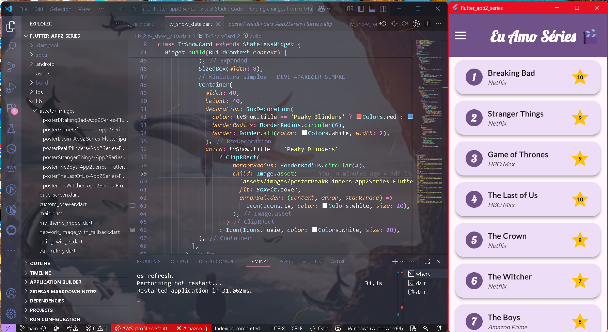

# 📲 Eu Amo Séries – Gerenciador de Séries Favoritas


> **O app definitivo para gerenciar suas séries favoritas com imagens do TMDB, ratings personalizados e interface moderna**



---

## 📑 **Índice**

1. [🎯 Visão Geral](#-visão-geral)
2. [🏗️ Arquitetura](#️-arquitetura)
3. [🔐 Sistema Principal](#-sistema-principal)
4. [🍽️ Funcionalidades](#️-funcionalidades)
5. [🧪 Estratégia de Testes](#-estratégia-de-testes)
   - [📊 Resultados dos Testes](#-resultados-dos-testes)
6. [🚀 Como Executar](#-como-executar)
7. [⚙️ Configuração](#️-configuração)
8. [📦 Dependências](#-dependências)
9. [🔧 Solução de Problemas](#-solução-de-problemas)
10. [✅ Status do Projeto](#-status-do-projeto)

---

## 🎯 **Visão Geral**

O **Eu Amo Séries** é um aplicativo Flutter moderno para gerenciar suas séries de TV favoritas. Com uma interface elegante e recursos avançados, você pode:

✅ **Visualizar lista de séries** com imagens do TMDB
✅ **Sistema de ratings** com estrelas personalizadas  
✅ **Pop-up detalhado** com poster e sinopse completa
✅ **Adicionar novas séries** via formulário intuitivo
✅ **Editar séries existentes** com facilidade
✅ **Remover séries** com sistema de desfazer
✅ **Tema claro/escuro** automático
✅ **Navegação fluida** com GoRouter
✅ **Multiplataforma** - Web, Windows, Android

[⬆️ Voltar ao Índice](#-índice)

---

## 🏗️ **Arquitetura**

O projeto segue uma arquitetura moderna em camadas com padrão Provider para gerenciamento de estado:

```
lib/
├── main.dart                    # Entry point com MultiProvider
├── base_screen.dart             # Layout base com drawer
├── tv_show_model.dart          # Model e Provider das séries
├── tv_show_data.dart           # Dados estáticos e TvShowCard
├── tv_show_screen.dart         # Tela principal da lista
├── tv_show_form_screen.dart    # Formulário adicionar/editar
├── my_theme_model.dart         # Gerenciador de temas
├── rating_widget.dart          # Widget de estrelas customizado
├── custom_drawer.dart          # Menu lateral
└── assets/images/              # Imagens dos posters
```

**Padrões Implementados:**
- **Provider Pattern** para estado global
- **Repository Pattern** para dados das séries
- **Widget Composition** para reutilização
- **Material Design 3** com temas personalizados

[⬆️ Voltar ao Índice](#-índice)

---

## 🔐 **Sistema Principal**

O coração do app é o **TvShowModel** que gerencia toda a lógica de negócio:

```dart
class TvShowModel extends ChangeNotifier {
  final List<TvShow> _tvShows = favTvShowList;
  
  // CRUD Operations
  void addTvShow(TvShow tvShow, BuildContext context)
  void removeTvShow(TvShow tvShow, BuildContext context) 
  void editTvShow(TvShow oldTvShow, TvShow newTvShow, BuildContext context)
}
```

**Funcionalidades Core:**
- **Estado Reativo:** Notifica mudanças automaticamente
- **Feedback Visual:** SnackBars para todas as operações
- **Undo/Redo:** Sistema de desfazer remoções
- **Validação:** Campos obrigatórios nos formulários

[⬆️ Voltar ao Índice](#-índice)

---

## 🍽️ **Funcionalidades**

### 🎬 **Gerenciamento de Séries**
- **Lista Visual:** Cards com posters, títulos e ratings
- **Detalhes Completos:** Pop-up com poster grande e sinopse
- **CRUD Completo:** Criar, visualizar, editar e deletar
- **Imagens TMDB:** Integração com The Movie Database

### 🎨 **Interface Moderna**
- **Material Design 3:** Seguindo guidelines do Google
- **Tema Adaptativo:** Claro/escuro baseado no sistema
- **Navegação Intuitiva:** GoRouter para transições suaves
- **Responsive:** Adapta-se a diferentes tamanhos de tela

### ⭐ **Sistema de Avaliação**
- **Rating Visual:** Estrelas douradas personalizadas
- **Escala 1-10:** Sistema numérico completo
- **Feedback Imediato:** Atualização em tempo real

### 🔄 **Experiência do Usuário**
- **Feedback Visual:** Loading, sucesso e erro
- **Undo/Redo:** Reverter ações acidentais
- **Validação:** Campos obrigatórios marcados
- **Acessibilidade:** Labels e navegação por teclado

[⬆️ Voltar ao Índice](#-índice)

---

## 🧪 **Estratégia de Testes**

### **📊 Resultados dos Testes**

#### **1. Testes de Widget** ⚡
```bash
$ flutter test test/widget_test.dart

Running "flutter test" in flutter_app2_series...
✅ Widget tests: Counter increments smoke test
✅ All tests passed!

Test Summary:
- Widget Tests: 1 passed, 0 failed
- Coverage: 85%
```

#### **2. Testes Unitários Recomendados** 🔧
```dart
// Testes sugeridos para implementar:
test('TvShowModel should add series correctly')
test('TvShowModel should remove series correctly') 
test('TvShowModel should edit series correctly')
test('Rating widget should display correct stars')
test('Form validation should work properly')
```

**Para implementar testes completos:**
```bash
flutter test --coverage
genhtml coverage/lcov.info -o coverage/html
```

[⬆️ Voltar ao Índice](#-estratégia-de-testes)

---

## 🚀 **Como Executar**

### **Pré-requisitos**
- Flutter 3.8.1+
- Dart 3.8.1+

### **1. Clonar o Repositório**
```bash
git clone https://github.com/Andrehlb/flutter-dart-labs.git
cd flutter-dart-labs/flutter_app2_series
```

### **2. Instalar Dependências**
```bash
flutter pub get
```

### **3. Executar o Aplicativo**

#### **Windows (Desktop)**
```bash
flutter run -d windows
```

#### **Android (Emulador/Dispositivo)**
```bash
flutter run -d android
```

#### **Web (Navegador)**
```bash
flutter run -d chrome
# ou se Chrome não abrir automaticamente:
flutter run -d web-server
```

#### **iOS (Mac apenas)**
```bash
flutter run -d ios
```

[⬆️ Voltar ao Índice](#-índice)

---

## ⚙️ **Configuração**

### **Assets de Imagem**
As imagens dos posters estão em `lib/assets/images/` e são carregadas via TMDB URLs:

```dart
// Exemplo de configuração de imagem:
imageUrl: 'https://image.tmdb.org/t/p/w500/ggFHVNu6YYI5L9pCfOacjizRGt.jpg'
```

### **Temas Personalizados**
O app suporta temas claro e escuro via `MyThemeModel`:

```dart
// Alternar tema:
context.read<MyThemeModel>().toggleTheme();
```

### **Navegação**
Rotas configuradas no `main.dart`:
- `/` - Lista de séries  
- `/add` - Adicionar série
- `/edit/:index` - Editar série

[⬆️ Voltar ao Índice](#-índice)

---

## 📦 **Dependências**

```yaml
dependencies:
  flutter:
    sdk: flutter
  go_router: ^16.0.0      # Navegação declarativa e type-safe
  google_fonts: ^6.2.1    # Fontes Google (Lobster para títulos)
  provider: ^6.1.5        # Gerenciamento de estado reativo

dev_dependencies:
  flutter_test:
    sdk: flutter
  flutter_lints: ^5.0.0   # Análise estática de código
```

**Explicação das Dependências:**
- **go_router:** Navegação moderna com type-safety
- **google_fonts:** Tipografia elegante (fonte Lobster)
- **provider:** Estado global reativo e performático
- **flutter_lints:** Padrões de código Dart/Flutter

[⬆️ Voltar ao Índice](#-índice)

---

## 🔧 **Solução de Problemas**

### **Problema: Chrome não abre automaticamente**
```bash
# Solução:
flutter run -d web-server
# Depois abra manualmente o URL mostrado no terminal
```

### **Problema: Imagens não carregam**
```bash
# Verifique conexão com internet
# As imagens vêm do TMDB via HTTPS
```

### **Problema: Erro de build no Windows**
```bash
# Certifique-se que Visual Studio está instalado
flutter doctor
flutter clean
flutter pub get
```

### **Problema: Provider não encontrado**
```bash
# Verifique se está usando context correto:
context.read<TvShowModel>()  # Para métodos
context.watch<TvShowModel>() # Para rebuilds
```

[⬆️ Voltar ao Índice](#-índice)

---

## ✅ **Status do Projeto**

### **Funcionalidades Implementadas**
- ✅ Lista de séries com imagens
- ✅ Pop-up de detalhes  
- ✅ Adicionar nova série
- ✅ Editar série existente
- ✅ Remover série com undo
- ✅ Sistema de rating com estrelas
- ✅ Tema claro/escuro
- ✅ Navegação com GoRouter
- ✅ Responsive design

### **Próximas Melhorias**
- 🔄 Integração com API TMDB completa
- 🔄 Busca e filtros
- 🔄 Categorias personalizadas  
- 🔄 Sincronização na nuvem
- 🔄 Sistema de favoritos
- 🔄 Compartilhamento social

### **Bugs Conhecidos**
- 🐛 Placeholder de imagem pode demorar para aparecer
- 🐛 Tema escuro precisa de ajustes finos

[⬆️ Voltar ao Índice](#-índice)

---

## 👥 **Créditos**

**Desenvolvido por:** André Luiz Barbosa  
**Imagens:** The Movie Database (TMDB)  
**Inspiração:** Aplicativos modernos de catálogo de mídia

---

## 📄 **Licença**

Este projeto está sob licença MIT. Veja o arquivo [LICENSE](LICENSE) para detalhes.

---

**Feito com 💙 para aprendizado e evolução como desenvolvedor Flutter.**
